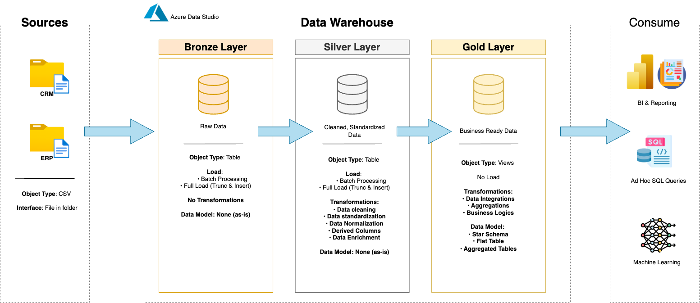

# Enterprise Data Warehouse & Insights Platform

Welcome to the **Enterprise Data Warehouse & Insights Platform** repository.  
This portfolio project simulates a real-world data warehousing solution, built from raw data ingestion through to analytical reporting. It reflects hands-on experience with modern data engineering practices and a layered architecture approach.

---

## 🧱 Architecture Overview

This solution is based on the **Medallion Architecture** pattern, broken down into three distinct layers:



1. **Bronze** – Raw data as received from source systems (CSV files). No transformations applied.
2. **Silver** – Cleaned, validated, and standardized data ready for querying.
3. **Gold** – Final business-ready tables modeled in a star schema to support reporting and dashboards.

---

## 📌 Project Scope

This project showcases:

1. **Warehouse Design** – Using a multi-layered architecture (Bronze → Silver → Gold).
2. **Data Pipelines** – Loading and transforming data from external flat files into a relational database.
3. **Dimensional Modeling** – Creating fact/dimension tables for analytics.
4. **Reporting Logic** – Writing SQL to extract key insights from the Gold layer.

🛠️ Tools & Concepts Used:
- Azure Data Studio   
- ETL Process Design  
- Data Quality Checks  
- Dimensional Modeling  
- SQL for Analytics

---

## ⚙️ Project Requirements

### Data Engineering Goals

#### Purpose
Build a centralized warehouse using SQL Server that aggregates CRM and ERP data for analytics use cases.

#### Functional Requirements
- **Sources**: Load data from flat files representing ERP and CRM exports.
- **Data Hygiene**: Clean inconsistencies and handle missing values before transformation.
- **Integration**: Join and harmonize data across systems into a unified model.
- **Scope Limit**: Only the current snapshot of data is modeled (no historical tracking).
- **Documentation**: Maintain clear metadata and definitions to support future analysis.

---

### Analytics Objectives

#### Purpose
Generate SQL-based reports to surface insights in the following areas:
- Customer behavior
- Product performance
- Sales metrics over time

These reports provide business users with actionable KPIs for strategy and operations.

---

## 📁 Repository Structure

```yaml
data-warehouse-project/
  datasets/                     # Source CSVs for CRM and ERP systems

  docs/                         # Diagrams, metadata, and documentation
    etl.drawio                  # Visual breakdown of ETL logic
    data_architecture.drawio    # Layered system architecture
    data_catalog.md             # Dataset descriptions and column-level metadata
    data_flow.drawio            # End-to-end flow of data through the layers
    data_models.drawio          # Dimensional model (star schema)
    naming-conventions.md       # Standardized naming rules

  scripts/                      # SQL scripts by layer
    bronze/                     # Load raw CSVs into staging tables
    silver/                     # Clean, validate, and prepare data
    gold/                       # Create business logic tables (facts and dims)

  tests/                        # Data quality checks and validation queries

  README.md                     # Project summary and how-to
  LICENSE                       # License info
  .gitignore                    # Ignore patterns for git
  requirements.txt              # Setup instructions and dependencies
